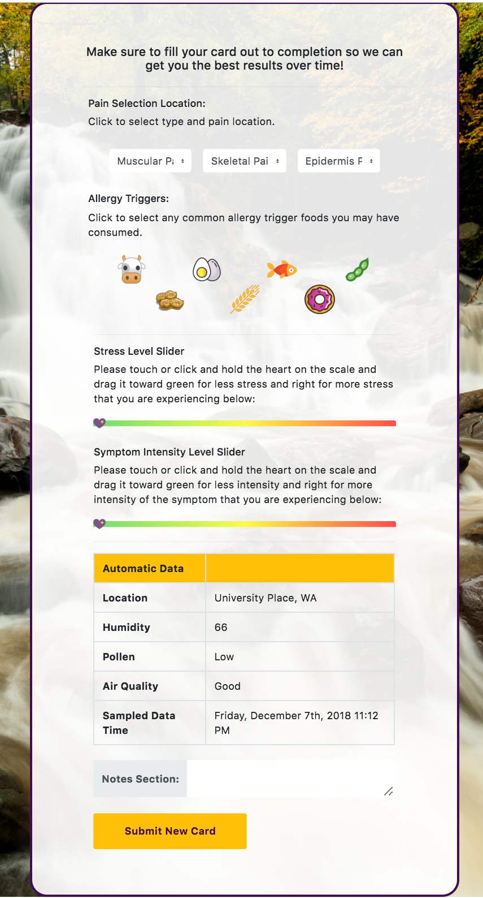
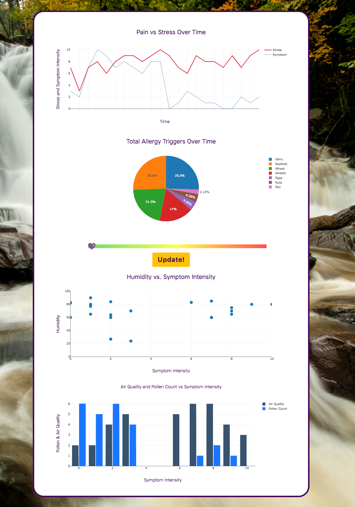

## MedSight

>Often the biggest problem with health is it is difficult to track and follow what is really going on. We can’t understand what is really happening in the 4th dimension. By 4th dimension, we mean time. Cannot recall what was eaten, where we were, and some of the more nuianced influencese, such as what the weather conditions were and a myriad of other items going on at the time. 
__Welcome MedSight!__

>Since our health is a cumulative endeavor, we strive to make accessibility and ease the forefront of focus for our application.

### API's Used
Weather-- https://www.accuweather.com/

## Submit New Card
>On the landing page is a greeting Quote of the Day and a blank card to fill in with symptoms experiences, as well as the automatically generated information about outside information, specific to the user and their location (such as pollution, pollen count, temperature, and humidity).

## Card Submissions
>Upon submitting each filled out card, MedSight transitions over to the card stack, populated with the users previous cards, which can then be sorted by both stress and symptom level.

## Dashboard
>Sliding over to the dashboard page shows the relationships between the data that has been captured by each card.
As the data is tracked, following each personal account, over time each user is provided with graphs and chartes to help visualize what is going on and possibly affecting their quality of health. This information can be a huge boost in correcting or assisting medical professionals, as well as the person, in taking control of their health instead of holding on by the reigns.

## Our Story
>We wanted to take the time and give a brief statement and photo of the creators of MedSight! We believe strongly in empowering people to take back their health. So visit Our Story page, read through some of the inspirations for this app, and click on our Github links to check out more of our own personal work. Thanks for stopping by!

### Project homepage: https://salty-basin-99417.herokuapp.com
### Repository: https://github.com/circuitsyn/MedSight